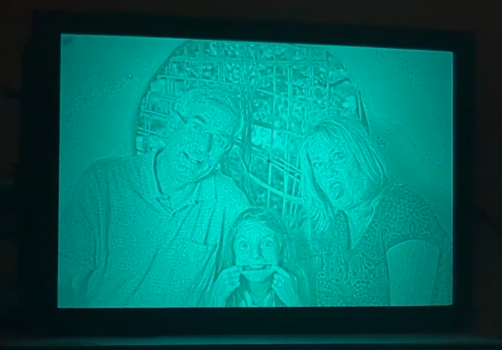
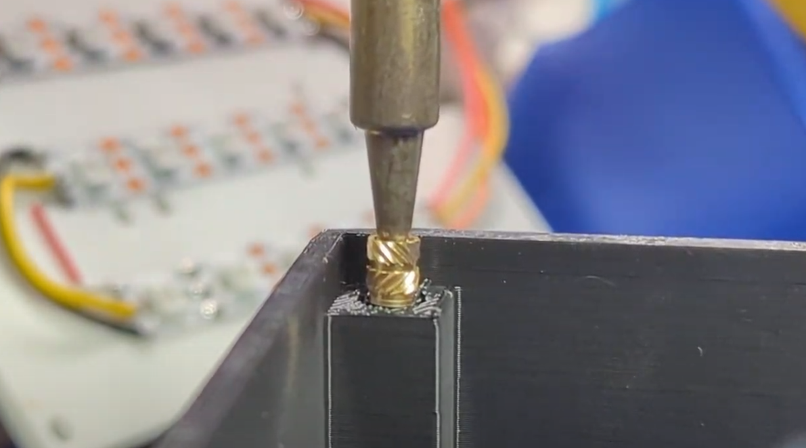
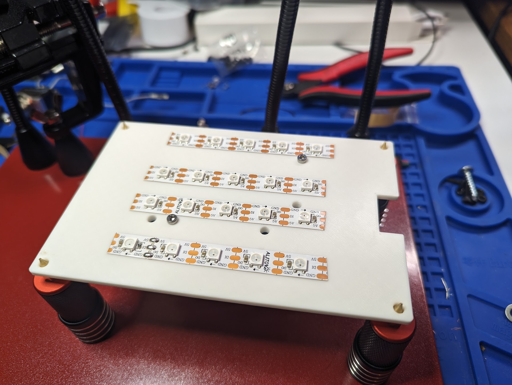
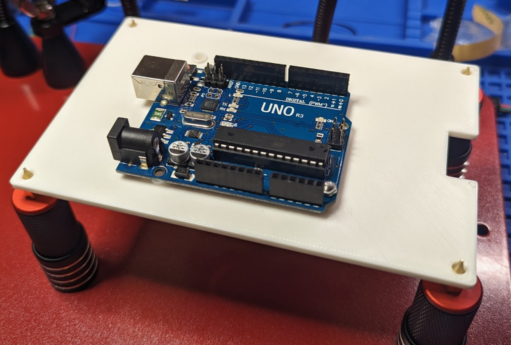
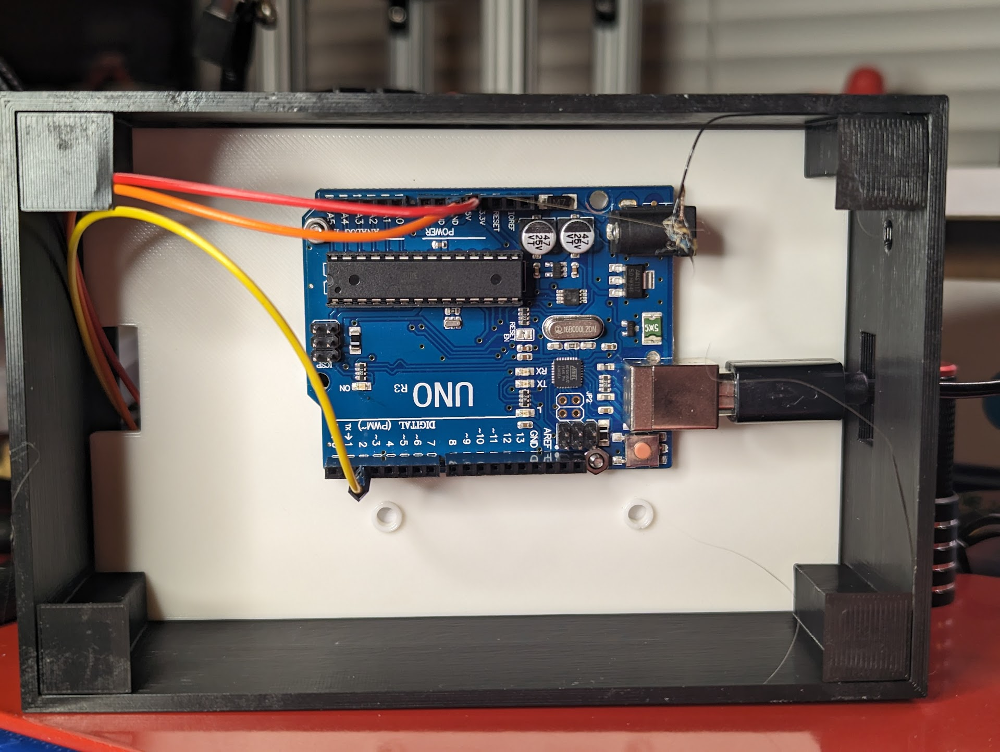

# LithoLED
A simple way to display your 3D printed Lithographs with LED backlighting.

[Parts Assembly Video](https://www.youtube.com/watch?v=f8gd6NIMTC4)

## What It Is
A backlit display case that uses LED light strips to shine light through your lithograph prints.  
The prints must be 100mm x 150mm x 2mm, but any number of prints can be swapped out.

## What Can It Do?
Out of the box it can:
- Provide the backlighting needed to see your lithograph images
- Give you control over both the color and brightness of backlight

## What do I need to make it?
You will need:
- An Arduino. The circuit mounting plate has mounting holes to accommodate an Arduino UNO, Arduino Mega, or Arduino Micro
- A LED lightstrip than can be cut to a specific length.
  - If you are buying the strip just for this purpose, do not spend the extra money on individually addressable lights. All lights will be showing the same color at the same time.
- A 3d printer. Almost any printer will work to make the case - it is much more demanding to make the lithos. If your printer can handle that it can handle printing the case.
- M3 Socket Cap screws and threaded inserts.
- A rotary encoder
- Dupont connectors to connect the encoder and LEDs to the microcontroller.
  - You will most likely have to strip and solder the ends of the Dupont connector wires that are attached to the LEDs.

## How do I make it
1. Print all models.
2. Use your soldering iron to heat and push the thread inserts into the 8 receptacle in the corners of frame.stl
   - 
3. Attach the LED strip to the **FLAT** side of the circuit mounting plate. Most LED strips will have adhesive backing, but hot glue works as long as you do not overhead the LED chips too much. **Do Not** cover any mounting holes.
   - 
4. Mount your board to the side of the circuit mounting plate that has the extruded rims around the holes
   - 
5. Insert the circuit mounting board into the frame so that the microcontroller is facing the USB cable access port and rotary encoder mounting hole.
   - 
6. Insert the rotary encoder in the round rotary encoder hole and connect it to the GND, 5V, and whichever 2 pins you designated for the encoder.
7. Plug in the USB power cable into the microcontroller and rout it through the square USB access port.
8. Screw in the backplate
9. Place your lithograph in front plate and gently press it on the front of the frame (LED side) until you feel it snap.
